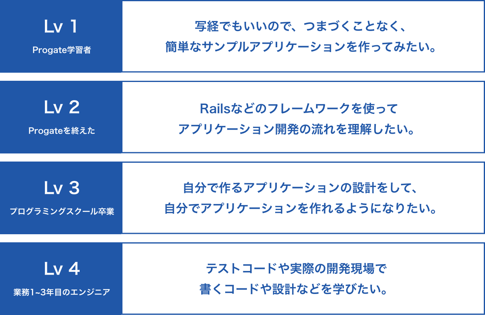

# 2-1 教材のテーマを考える

優れた教材を作成する最初のステップは、**この教材を買うことによって学習者は何ができるようになるかという学習者への価値を考える**を考えることです。まずは、以下の3つの項目を考えて、教材のテーマを充実させます。

* 今回執筆する教材が終わったら何ができるようになるか（ゴール）
* 今回作成する教材を誰が受けるべきで、誰が受けるべきでないか（対象）
* どの技術を中心に教えるのか（技術）

項目を一つずつ確認します。

### **今回執筆する教材が終わったら何ができるようになるか（ゴール）**

**自分が執筆する教材を終えた人がどのような状態になっていて欲しいのかを設定すると、自分の思いが伝わりやすい技術コンテンツを作成できます。**このゴールを考えることが教材作成において一番重要です。

もし目的を思いつかないようであれば、自身の役に立つもの・困っていること・解決したいことを目的に設定しても大丈夫です。

ゴールを明確にし、そのゴールを達成できるように教材を執筆することで、学習者が満足できる教材を作成できます。

### 今回作成する教材を誰が受けるべきで、誰が受けるべきでないか（対象）

まず教材のターゲットとなる学習者を決めます。「フレームワークを使ってアプリケーション開発の流れを理解したい人」を想定しているのか、もしくは「テストコードや実際の開発現場で書くコードや設計などを学びたい人」を想定しているのか。その対象者に応じて教材の内容も変わりますし、解説が必要な量も変わってくるかと思います。誰を対象に教材を作成するかを決めることは非常に重要です。

ちなみにTechpitでは、プログラミングスクールを卒業した学習者や業務歴1年~3年のエンジニアのユーザーが多くいます。なので上記のレベルでいうとLv3 - Lv4 あたりの**実践的な内容がニーズ**あります。

### どの技術を中心に教えるのか（技術）

プログラミングを教える上で全ての技術を同時に教えるは大変です。なので、技術分野を絞ってプログラミングを教えることが非常に大切です。
例えば、Ruby on Railsを使ったWebアプリケーション開発を教えるとします。Ruby on
Railsの開発では以下のような知識が必要になります。

* HTML/CSS
* Javascript
* Ruby on Rails
* SQL
* Git

これら全ての技術を一気に学習するのは非常に難しいです。なので、一番教えたい分野
に焦点を当てる必要があります。例えばRuby on Railsを中心に教えたい場合、見た目を整
えるHTML/CSSに関しては、あまり力を入れないカリキュラム構成にし、RubyやRailsに
関してはみっちり教える構成にします。
このように教えたいことを明確にすることで、学習者も1つの分野に集中して取り組む
ことができます。

### テーマの例

例えば「[【Ruby on Rails 5】Instagram風簡易SNSアプリを作ってみよう！](https://www.techpit.jp/p/instagram)」という教材では以下のようにテーマを設定しています。

**この教材を終えたら学習者はどのような状態になっているか**

* MVC を理解している状態
* Rails で簡単な機能実装ができるようになる

**誰を対象としている教材なのか**

* ProgateなどのRailsの教材を見ながら簡単なサンプルアプリケーションを作ったこと
  がある方
* Rubyは学んだことがあるけど、Railsはあまり触ったことがない方
* Ruby on Railsの開発の大まかな流れを把握したい方

**どの技術を中心に教えるのか**

* MVC
* Ruby on Rails

このように教材のテーマを考えることが教材作成の最初のステップになります。

