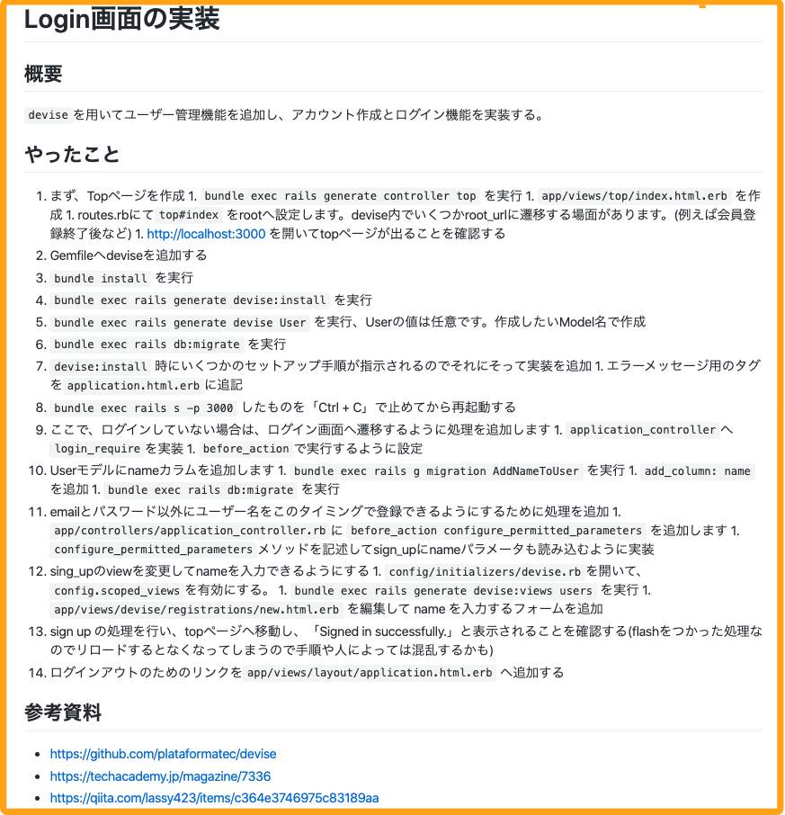

# 3-1 目次に沿って実装し、実装方法の簡易手順書を作成する

それでは目次に沿って実装を進めましょう。このページでは実装しながら実装方法を執筆する方法を記載しています。

実装方法の執筆で主に記載することは以下の2つです。

* 簡易な実装方法をテキストで記載
* 参考にしたリンクがあればメモとして記載

具体的にどのように記載していくのか1つずつ説明していきます。


教材で作成するアプリケーションのソースコードは、ご自身のGitHubアカウントのリポジトリにpushしていただければと思います

執筆に関しては、こちらでご用意した執筆専用のリポジトリに執筆を進めてください


### 1. 簡易な実装方法をテキストで記載

簡易な実装方法をテキストで記載することで、執筆する際にスムーズに実装方法を執筆することができます。

**サンプル例**

詳細はGitHub上に実装方法の簡易手順書のサンプル例をご用意していますので是非ご覧ください。

{% embed url="https://github.com/Techpit-Market/curriculum-format/blob/master/%E7%B0%A1%E6%98%93%E6%89%8B%E9%A0%86%E6%9B%B8%E3%81%AE%E3%82%B5%E3%83%B3%E3%83%97%E3%83%AB%E4%BE%8B.md" %}

### 2. 参考にしたリンクがあればメモとして残す

参考にしたリンクがあればメモとして残しましょう。

### **GitHubに完成版のコードを用意**

実装したら**完成版のコードをご自身のGitHubアカウントのパブリックリポジトリにpushしましょう**。完成版のコードをGitHubに上げることで、教材内に完成版のコードを共有することができます。

また、完成版のコードは作成していただいた**目次の章ごともしくはパートごとにコミットしてください。そうすることで章\(パート\)ごとに完成版のコード\(diff\)を用意できます**。章\(パート\)ごとに完成版のコードがあることで、学習者が学習途中につまづいたとしても、完成版のコードを見ることによって自力で解決しやすくなります。

もしコミットした後にコードを修正する場合は、 `git rebase` を使うことで、調整することができます。

#### GitHubのライセンスに関して

GitHubで教材のソースコード等を公開する場合、ライセンスはなくても大丈夫です。  
ライセンスがない場合は、デフォルトの著作権法が適用され、改変はできませんが、改変せずにそのまま使用することだけであれば問題なく使用できます。  
[https://choosealicense.com/no-permission/](https://choosealicense.com/no-permission/)

ただ、ソースコード等を改変・改善しても問題ない場合は、ライセンスは「MIT License」にされても大丈夫です。

