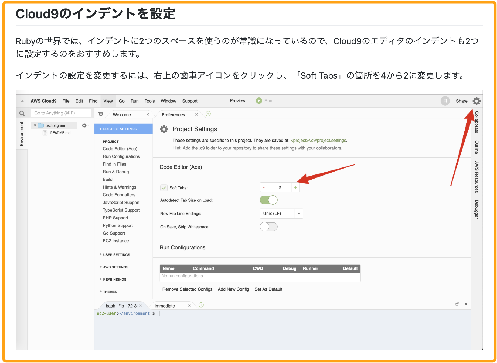

# 4-2 セクション0 \(0章\) を執筆する

ではいよいよカリキュラムを執筆しましょう。基本的には作成された目次をベースにカリキュラムを執筆していきます。

### セクション0を執筆する上での注意点

セクション0を執筆する上で主な注意点は以下の2つです。

1. 環境構築方法をリンクで説明しない
2. 外部サイトにアクセスする際は画像を貼る

1つずつ見ていきます。

### 1. 環境構築方法をリンクで説明しない

タイトル通りですが、環境構築方法を「このリンクを見て環境構築してください。」という風にリンクだけで説明はしないでください。リンクの場合、そのリンク先の説明が間違っている可能性もありますし、リンクが切れる可能性もあります。

ただ**公式サイト**で説明が非常に分かりやすい場合はリンクを使っても構いません。例えば、AWSの公式にある「[AWS アカウント作成の流れ](https://aws.amazon.com/jp/register-flow/)」は図を使ってステップバイステップで説明しており非常に分かりやすいです。こういった場合はリンクを活用されて大丈夫です。

\*\*\*\*

### 2. 環境構築で外部サイトにアクセスするときは画像を貼る

環境構築する際に外部サイトにアクセスしてダウンロードしたりすることがあると思います。外部サイトにアクセスする際は画面のどこを見ればいいのかテキストだけだと分かりづらいので、画像を使って説明すると分かりやすくなります。

**例）**

上記の例のようにCloud9でインデントの設定を変更する場合はどのようにしたらいいかテキストと画像を使って説明することで分かりやすくなります。

**0章以降も外部サイトにアクセスする際は画像を使って説明**していただければと思います。

セクション0のフォーマットに関しては、Githubを使って簡単に導入できるリポジトリをご用意しています。以下のリポジトリのREADME.mdを参考に導入してください。



