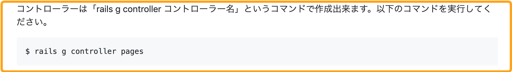

# 4-5 コマンド実行箇所のフォーマット

### コマンド実行箇所のフォーマット

コマンドの実行を書く際は以下のフォーマットに従って記載してください。

1. どういうコマンドを実行するのかコマンドの説明
2. コマンドを記載
3. コマンドの実行結果を記載

項目を一つずつ説明します。

### 1. どういうコマンドを実行するのかコマンドの説明

どういうコマンドを実行するのか説明がない状態で、「以下のコマンドを入力してください。」と言われても学習者は、何のためにコマンドを実行するのか、どんなコマンドを実行するのか分からないまま進めることになります。

なのでどういうコマンドを実行するのかコマンドの説明を最初にしましょう。

### 2. コマンドを記載

次にコマンドを記載します。コマンドを記載する注意点としては最初に「**$**」をつけてください。「**$**」をつけることで、学習者はコマンドと認識しやすくなります。

**例）**

### 3. コマンドの実行結果を記載

最後にコマンドを実行したら、どういった結果が表示されるか**コマンドの実行結果を記載してください。**コマンドの実行結果がない場合、学習者はコマンドを実行してもうまくいったのか分かりません。

逆にコマンドの実行結果を表示することで、学習者は自分が実行したコマンドが正しいかどうか確認することができます。

**例）**

下記の例のようにコマンドの記載と実行結果を分けて表示してください。

