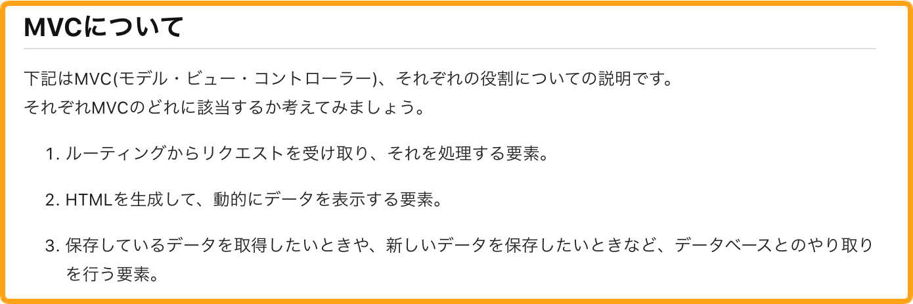
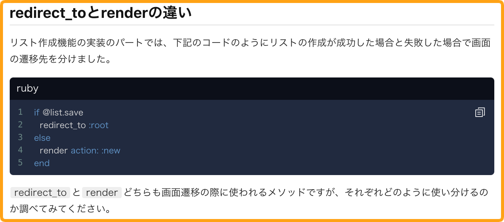

# 4-10 演習問題の作り方

受講生にとって学びの多い教材を執筆するには、演習問題を用意するのが効果的です。
このガイドラインではどのような演習問題を用意すると学習に効果的かをご紹介します。

実際に演習問題の参考例も載せておりますのでよりイメージしやすくなっているかと思われます。
またこちらに記載されていないもので、こんな問題があっても良さそうだなというのがありましたら、ぜひご自由にお試しいただければと思います。

## 演習問題に求められること

まずはじめになぜ演習問題を用意すべきかについて簡単に説明をすると、現在Techpitで教材を受講されている方から以下のようなお声をいただくことがあります。

- 自分の頭で一度学んだことを整理したい
- 教材に付随する応用的な知識を身につけたい
など

そこで、ただ受動的にインプットして終わりの教材ではなく、演習問題として一度自分の頭で考えて答えを導き出すような能動的に学習するパートがあるとより良い教材になるのではないかと思うようになりました。

その中で、今回は実際に運用してみてよかった演習問題の作成例をいくつかご紹介します。

## 演習問題の作成頻度

まずは演習問題を作成するにあたりどの頻度でいくつ問題を用意すればよいかが気になるところだと思いますのでお答えします。

結論、0章や環境構築を除いた各章ごとに3~5つほど問題をご用意いただければ十分です。
多すぎてもかえって受講生の負担となってしまいますので、ほどよい質問数を意識していただければと思います。

## 演習問題の作成例

それでは実際にどういった演習問題を用意するとよいか解説します。

まず前提として、Techpitでは技術の知識（≒暗記）よりも技術の使い方を学んでもらうことに重きを置いています。
実際の開発業務でも全てを暗記する必要はなく、適切なタイミングで適切な技術を適切に扱えるスキルの方が重宝されます。

そのため暗記することを前提とした演習問題はなるべく避けるようにしています。

### 1. 章で出てきた内容のおさらい問題
一番シンプルな演習問題です。その章で学んだ内容を振り返ります。
今後の開発で頻出するであろうコマンド等を確認する問題としてオススメです。

### 2. 概念についての問題
RailsやLaravelといったフレームワークをはじめその技術の根幹となる概念に関してはしっかりと理解している必要があります。

もし新しく概念を学ぶ際にはそれについての演習問題を用意してあげることにより、自身の頭で整理する時間が生まれるので理解を深めてもらいたい場合にはオススメです。

### 3. 類似した技術の比較問題
同じことをできる類似の技術がある場合にオススメの問題です。

お互いに比較しながらそれぞれの相違点を確認してもらうことで教材の解説だけにはおさまらないプラスアルファの学びを得られます。

### 4. なぜその実装をしたのかを深ぼる問題
他の実装方法も考えられたが特定の実装方法を採用した場合にオススメの問題です。

これは技術を知っているだけでなく、適切に扱えるかを問う問題なので受講生はより深くその技術について知ることができます。

### 演習問題の答えに関して

演習問題の答えに関しましては、用意することを推奨しますが必須ではありません。

オススメは教材内で扱った内容はそのパートを参照するに留め、もし教材内で扱っていない応用的な問題を用意する際は、箇条書きと参考リンクでも構いませんので簡単に解説を用意してあげると親切かと思われます。

もし答えを用意しない場合は、以下のように一言を断りを入れておきましょう。

