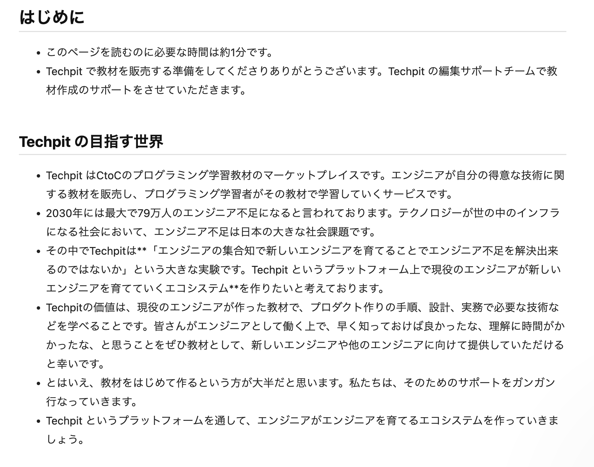

# 4-10 執筆におけるアンチパターン

執筆を進めていくなかで、どういう風に進めていったらまずいのか、また分かりにくい教材のパターンを紹介できればと思います。

## 本ページの構成

* おすすめしない執筆の進め方
* 分かりにくい教材の構成やパターン
* 意図と異なるマークダウンの利用について

## おすすめしない執筆の進め方

おすすめしない執筆の進め方は主に3つあります。

1. 実装しながら執筆する
2. 執筆レビューの修正対応より先に執筆する
3. 執筆スタイルガイドをあまり見ないで執筆する

1つずつ説明します。

### 1. 実装しながら執筆する

教材で作成するアプリケーションを実装しながら執筆すると、途中でコードを変更したくなったときに、そのコードが教材で複数登場していれば、複数箇所修正しないといけなくなります。それは非常に手間です。なので執筆する前に教材で作成するアプリケーションを実装しましょう。


実装するアプリケーションの規模が小さい場合は、実装しながら執筆を進めても問題ありません。


### 2. 執筆レビューの修正対応より先に執筆する

執筆レビューの修正対応より先に執筆を進めた場合、同じ修正を何度もする可能性があります。それは非常に手間だと思います。レビューが上がってきたら、まずレビューを確認しましょう。


運営のレビューがまだ完了していない場合は、どんどん先に進められて大丈夫です。


### 3. 執筆スタイルガイドをあまり見ないで執筆する

執筆スタイルガイドは、Techpit がこれまで2年以上運営してきたなかの教材作成における**ノウハウ**になります。どういう構成にしたらいいか、どういう風にしたら分かりやすいかなど細かいところまで記載しています。執筆スタイルガイドを把握した上で執筆を進めていきましょう。


執筆スタイルガイドは日々カイゼンしています。不明点や要望などありましたらお気軽に聞いてください。


## 分かりにくい教材の構成やパターン

次に分かりにくい教材の構成やパターンを紹介します。

1. 1つのコードブロックに対して実装のスコープが大きい
2. 1ページの文量が多い
3. 主語が曖昧になりやすい言葉を使用する

### 1. 1つのコードブロックに対して実装のスコープが大きい

学習を進めていく際は、1つ1つステップバイステップで進めた方が分かりやすいです。逆に、1つのコードブロックに対して実装のスコープが大きくなると、コードを見る量、学ぶ量が多くなり、今自分が何をしているのか分からなくなります。人間そんなに一気に頭に詰め込むことはできません。

なので、できるだけステップバイステップで実装を進められるような構成を意識しましょう。

### 2. 1ページの文量が多い

1ページの分量が多くなる場合、読むのが大変になります。Techpit は、Web上で学習をするため、1ページの文量が多くなればなるほどスクロールしないといけなくなるからです。また体験的にも達成感を味わいにくくなります。なので、1ページの文量は多くても**10000字**程度になるようにしましょう。

### 3. 主語が曖昧になりやすい言葉を使用する

文章中の「〜〜を記載します」や「〜〜に変更します」といったコードやプログラムの操作に関わる動詞の現在形は
- 執筆者が解説のために行ったこと
- 教材として学習者が行わなければならないこと

というの2つの捉え方ができてしまいます。そのため学習者はその文章を読んだ際に自身がコードの操作をすべきかどうか悩んでしまいます。

これを防ぐため、学習者にしてほしいことは「〜〜を記載してください」や「〜〜に変更しましょう」などの依頼表現にしてください。同様に学習者が操作する必要はなく、解説のために執筆者が行ったことは「〜〜を記載しています」や「〜〜に変更しました」など過去形にしましょう。

## 意図と異なるマークダウンの利用について
意図と異なるマークダウンの使い方での執筆をされていることがあります。
「4-8 見やすい文章を書くためのマークダウンの書き方」にて紹介しているマークダウンの使い方に沿って執筆してください。


意図しないマークダウンの利用は執筆レビューで修正をお願いしますが、広範囲での修正になる可能性もありますので、マークダウンの使い方の確認をお願いします。もし悩んだ場合はまず相談してみてください。


マークダウンのアンチパターンを紹介します。

### 強調に斜体や引用を使う

引用は文章を他文献から文章を紹介する際に利用するもので、文章を強調するために利用するのは避けてください。見出しにはh1やh2タグ、強調には`**通常の太文字**`を使用するようにしてください。

斜体もアルファベットの協調として利用されることもあると思いますが、Techpit上では「太文字での強調」に統一できればと思います。

### 全文を箇条書きで記述する

箇条書きは複数の項目を端的に列挙する際に利用してください。
文章で記述していても、全ての文章が箇条書きで1行ずつ記述されている場合、可読性が低くなってしまいます。

この画像は実際に全ての文章を箇条書きで記述した例です。

このように、段落がわかりづらく可読性が低くなります。

項目を列挙する場合のみに箇条書きや表形式を利用し、段落を分けたい場合は改行を用いて記述していただければと思います。
