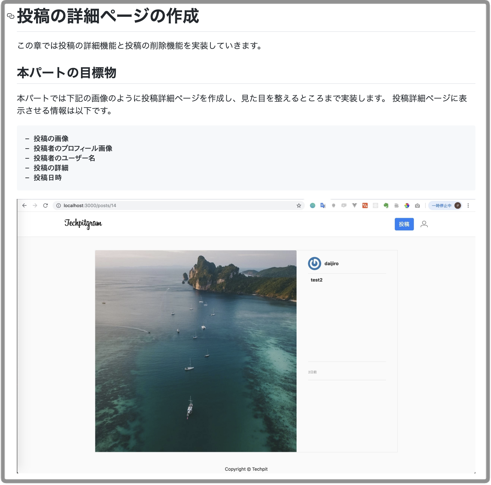
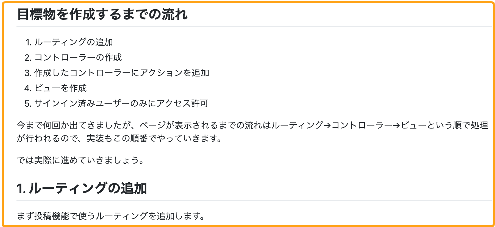
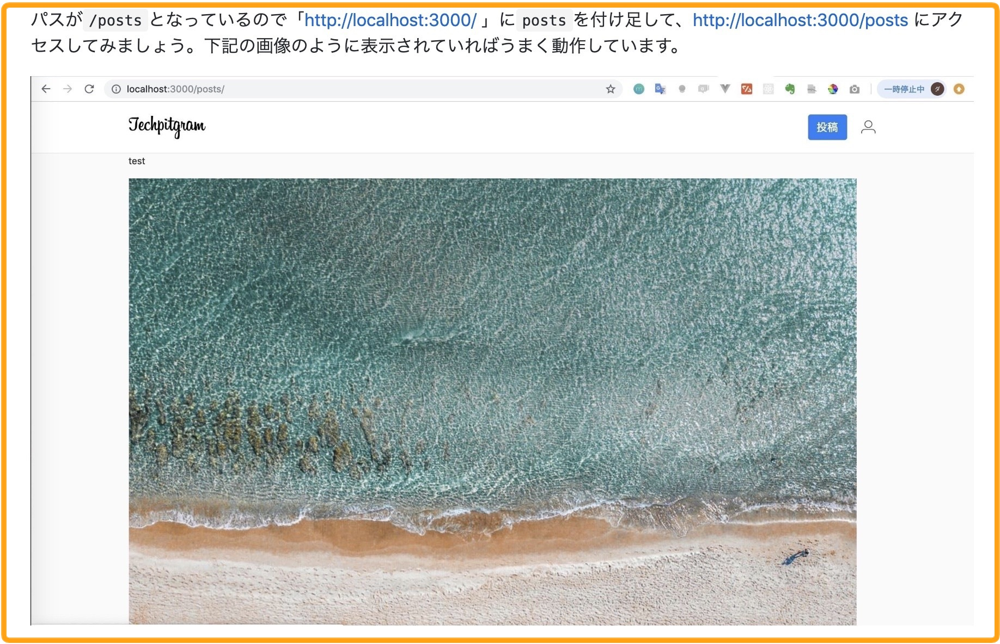

# 4-3 セクション1以降を執筆する

### セクション1以降の基本フォーマット

セクション1以降の基本フォーマットを下記に示します。

* パートのタイトル
* 本パートの目標物
* 目標物を作成するまでの流れ
* 動作確認
* パートの最後に一言

項目を一つずつ説明します。

### パートのタイトル

パートのタイトルには、目次を作成した際のパートのタイトルを書いてください。

### 本パートの目標物 \(ゴール\)

**何を実装するのか具体的なゴールがないと、指示通り実装したとしても、「本当にこれで合っているのだろうか」と不安になります。また、何を実装するのか実装する前に理解していないと、今書いているコードが作りたい機能のどこに役立つのか分かりません。**

なので、実装する前に今から何を実装するのか**ゴール**を明確にする必要があります。ゴールで記載することは以下の2つです。

* **何を実装するのか**
* **本パートで何を学ぶのか**

上記の2つを実装する前に認識していると、学習者は実装するのかイメージができゴールに向かって学習できます。

実際に目標物\(ゴール\)がある場合の例を下記に示します。どのような見た目になるか画像があり、どういった情報が必要か記載することで、何を実装するかイメージがしやすくなります。

**例）**

### 目標物を作成するまでの流れ \(ゴールを達成するまでの流れ\)

パートでどういったことをするのか、ゴールを記載したらそのゴールを達成するための流れを記載してください。ゴールとその流れを記載することで、学習者は全体像を掴みやすくなります。また執筆する際もパートの構成を整えやすくなります。

**例）**

### 

### 動作確認

動作確認ができる箇所は適宜GIF画像や画像を使って実装イメージを表示してください。**教材の構成としては細かく動作確認ができる方が、仮に学習中つまづいてもどこで間違えたのかスコープが小さいほど誤りを見つけやすいです。**

また動作確認する際に、特定のリンクにアクセスする必要がある場合は、どのリンクにアクセスすれば動作確認ができるかリンクも追加してください。

**例）**

**※** GIF画像をとるツールとしては [Gyazo](https://gyazo.com/ja) がおすすめです。

\*\*\*\*

### パートの最後の一言

各パートの最後には簡単なコメントや一言を入れてください。仮に最後の一言がなく、コードや画像でパートが終了している場合、読み手は「**まだ続きがあるのでは？**」と考えることが分かりました。なので**パートが終わったことを明示的に示すことで読み手は安心して次のパートに進むことができます。**

\*\*\*\*

セクション1以降のフォーマットに関しては、Githubを使って簡単に導入できるリポジトリをご用意しています。以下のリポジトリのREADME.mdを参考に導入してください。



