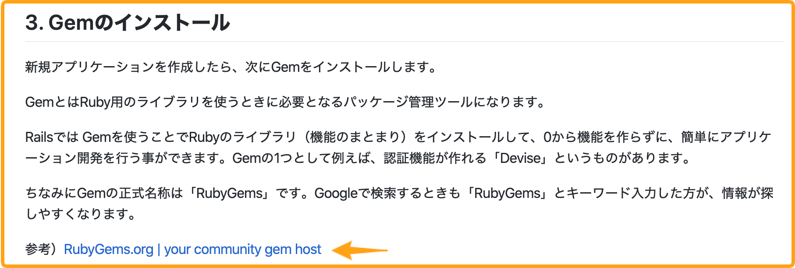

# 4-4 実装箇所の説明のフォーマット

## 実装箇所の説明のフォーマット <a id="nonofmatto"></a>

コードを書く際には以下のフォーマットに従って記載してください。

1. 何を実装するのか記載
2. ディレクトリ・ファイル追加
3. 実装箇所を記載
4. コードを貼り付ける
5. コードの説明
6. 必要があればリンクを追記して説明を補足

4と5に関しては、5 -> 4 の順序でも構成としては成り立ちますが、Techpitの教材内においては4 -> 5の順序で統一し、学習者が戸惑わないようにしてください。

なお、実装のスコープが大きくならないよう注意してください。

目安として、「4. コードを貼り付ける」の1回分のコードで実装される内容は、1メソッド程度としてください。

つまり、例えば1節内で複数メソッドを実装する内容だとしたら、1節内で上記の「1〜6」の内容が複数サイクル登場する構成にしてください。

「4. コードを貼り付ける」の1回分のコードで多くの実装を行うと、教材執筆や教材のアプリを早く完成させるという面では効率的ですが、学習者の理解が追いつかず、わかりづらい教材になってしまいます。

学習者がステップ・バイ・ステップで理解できるような構成を心掛けてください。

では、上記「1〜6」の項目を一つずつ説明します。

## 1. 何を実装するか記載

コードを追加する前にまず何を実装するか説明を追加してください。もし何も説明がない状態でコードを追加してしまうと、学習者は追記したコードが何をしているのか分からなくなります。

## 2.ディレクトリ・ファイル追加

新しくディレクトリを追加する場合は「mkdir」コマンドを、ファイル追加は「touch」コマンドを使用してご記載ください。これにより、学習者のタイプミスが少なくなります。

### 例 シンプルなディレクトリ追加の記述方法

```text
mkdir techpit/match/views
```

```text
touch techpit/match/views/index.py
```

※windowsの場合はtouchコマンドの代わりに以下のコマンドをご記載ください。

```text
type nul > ファイル名
```

また、必須ではありませんが、以下のようなディレクトリツリーがあると、学習者がどのファイルを編集しているかが視覚的に判断することができます。

### 例 ディレクトリ追加後にディレクトリツリーを記述する場合


階層構造に関してはtreeコマンドを使えば容易に表示が可能です。お使いのPCがMacであれば以下のコマンドでインストールすることができます。

```text
brew install tree
```

## 3. 実装箇所を記載

次に実装箇所を記載します。実装する場所を記載することで学習者がどのファイルにコードを追記すればいいのか分かりやすくなります。

### 例 ファイルパスを記載した実装箇所の説明

下記の例のようにどこのコードを追加・編集するのか、ファイルパスを記載します。**注意点としてはファイルパスはプロジェクトのルートディレクトリから記載してください。**
また、プロジェクトのルートディレクトリを教材におけるプロジェクトの作成時に明記してください。

**プロジェクトのルートディレクトリとは、サンプルアプリにおけるファイル構造の最上階層のディレクトリで執筆を統一してください**


## 4. コードを貼り付ける

上記の2点を記載したらコードを貼り付けてください。コードの**インデントは揃える**ようにお願いします。コードを追記する際の注意点としてはファイルのどこにコードを追記したのかコメントアウトで分かるようにするか、`diff` を使ってコードを書いていただければと思います。

またコードを記載する際は、以下の点を守るようにしてください。

1. \`\`\`と\`\`\`で囲むことでコードブロックで表示する
2. \`\`\`の後にコードのファイル拡張子を付けて、コードに色の付くシンタックスハイライトで表示する
3. ファイル拡張子の後に`:ファイルパス`を付けることで、操作対象のファイルが何であるのかよりわかりやすくする 
4. 追加・編集・削除したコードはコメントアウトまたはdiff形式で記載してください(例2, 例3を参考にしてください)
※ 解説コードの場合、ファイルパスに`解説`, コマンド実行の場合はファイル拡張子に`console`, diffを用いた差分表示の場合はファイル拡張子に`diff`とつけることでtextlintで指摘されなくなります。

マークダウンで実際に記述した例は以下になります。


これはTechpit上では以下のように表示されます。


続いてコードの記載例を以下に示します。

### 例1 変更箇所が1行の場合のコメントアウトでの記述

下記の例のようにコードを追加する箇所をコメントアウトで明確にすることで学習者が迷わずにコードを書くことができます。追加・編集する行が1行の場合はコメントアウトも1行で構いません。
※ コードブロック中の全てが新規追加のコードの場合でも追加する箇所をコメントアウトで記載するよう統一してください。


### 例2 変更箇所が複数の場合のコメントアウトでの記述

追加するコードが複数行ある場合はコメントアウトの前後に改行を入れることで、どこからどこまでコードを追加するか明確にすることができます。


### 例3 コード量が多い場合の変更箇所の記述 <a id="kdono"></a>

コード量が多いときに全てのコードを表示させると、学習者は長いコードの中からどこを追加・編集するのが大変です。
また執筆する際も全てのコードを表示するのは手間です。**なのでコード量が多いときは下記の例のように該当箇所の前後3行のコードを表示させ、それ以外は省略してください。**


### 例4 diffを用いた変更箇所の記述
コードの編集には`diff`を用いると、変更箇所がわかりやすくなります。
特に、コードの削除や一部書き換えなどの場合は`diff`を利用することをお勧めします。

マークダウンで実際に記述した例は以下になります。
  


このマークダウンを用いると、Techpit上では以下のように削除された行や追加された行がわかりやすく表示されます。


## 5. コードの説明

コードを貼り付けたら、追記したコードを説明してください。

初めて出てきたコードに関しては説明をお願いします。同様のコードが過去に登場している場合は省略いただいて結構です。省略の際には過去にどこで解説したかを状況に応じて記載いただけると学習者が再び解説を辿れるようになるため、必要に応じてご記載ください。（反復して出現する場合に毎回記載する必要はありません。）

説明のポイントとしては**このコードでどういったことやっているか1つずつ**説明すると分かりやすい教材になります。

またコードの説明に関しては**コメントアウトで説明せず**以下の画像のように**1つずつテキストで説明**を追加してください。

### 例1 コードの説明記述


また、説明の粒度ですが、if文やfor文といった制御構文やクラスやメソッドの宣言方法などのような基本的な文法は説明しなくても構いません。基本文法に関しては以下のチートシートを参考にしてください。

参考）[プログラミング言語の基本文法チートシート](https://qiita.com/gakuri/items/5b252a4b4f8c9c5a2793)

ただ、**フレームワーク特有のメソッドや用語は必ず説明してください**。学習者のほとんどがフレームワークの使い方や大方の流れを理解するために教材を購入しているからです。

### 例2 基本文法を省いたコードの説明記述

以下の画像のようなコードの場合、if文やメソッドの宣言方法、変数への代入といった基本的な文法の説明は省き、newメソッドやprivateメソッドといったフレームワーク特有のメソッドやコードの書き方に関しては説明をしてください。


またHTMLとCSSの説明までしていると非常に大変なのでHTMLとCSSの説明は省略されて大丈夫です。（HTML/CSSがメインのコースでは説明してください）

## 6. 必要があればリンクを追記して説明を補足

基本的にはテキストベースで説明を書いていただきますが、補足が必要な場合は**公式ドキュメント**のリンクを追記してください。

**注意点としては、リンクはあくまで説明の補足です。リンクで説明をすることは避けてください。**

### 例 リンクを用いた説明補足

下記の画像のようにテキストベースで説明をして、補足として公式ドキュメントのリンクを記載します。リンクはURLではなく、マークダウンのテキストで表示してください。



