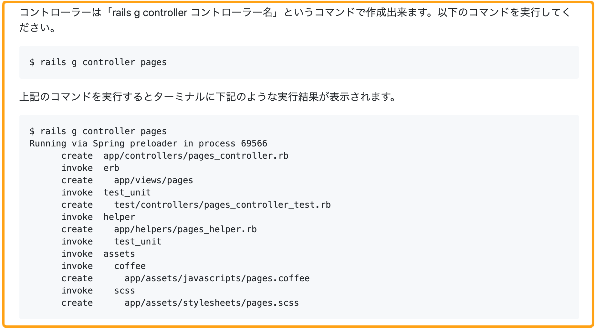

# 4-5 コマンド実行箇所のフォーマット

コマンドの実行を書く際は以下のフォーマットに従って記載してください。

1. どういうコマンドを実行するのかコマンドの説明
2. コマンドを記載
3. コマンドの実行結果を記載

項目を一つずつ説明します。

### 

### 1. どういうコマンドを実行するのかコマンドの説明

どういうコマンドを実行するのか説明がない状態で、「以下のコマンドを入力してください。」と言われても学習者は、何のためにコマンドを実行するのか、どんなコマンドを実行するのか分からないまま進めることになります。

なのでどういうコマンドを実行するのかコマンドの説明を最初にしましょう。

### 

### 2. コマンドを記載

次にコマンドを記載します。コマンドを記載する注意点としては最初に「**$**」をつけてください。「**$**」をつけることで、学習者はコマンドと認識しやすくなります。

**例）**


### 

### 3. コマンドの実行結果を記載

最後にコマンドを実行したら、どういった結果が表示されるか**コマンドの実行結果を記載してください。**コマンドの実行結果がない場合、学習者はコマンドを実行してもうまくいったのか分かりません。

逆にコマンドの実行結果を表示することで、学習者は自分が実行したコマンドが正しいかどうか確認することができます。

**例）**

下記の例のようにコマンドの記載と実行結果を分けて表示してください。




### npm や yarn でライブラリをインストールする場合

npm や yarn でライブラリをインストールする場合は、うまくライブラリが追加できているか確認のため、 コマンドの実行結果だけでなく、 `package.json` の変更差分も表示するようにしましょう。


**【例】**

Node のプロジェクトでパッケージを導入する場合は `yarn add` \(またはnpm install\) コマンドを使います。 webpack を導入するには以下のコマンドを実行してください。

```bash
$ yarn add webpack webpack-cli
```

コマンドを実行して、以下のように出力されていれば問題なく実行できています。

```bash
$ yarn add webpack webpack-cli
yarn add v1.22.4
info No lockfile found.
[1/4] 🔍  Resolving packages...
warning webpack > watchpack > watchpack-chokidar2 > chokidar@2.1.8: Chokidar 2 will break on node v14+. Upgrade to chokidar 3 with 15x less dependencies.
warning webpack > watchpack > watchpack-chokidar2 > chokidar > fsevents@1.2.13: fsevents 1 will break on node v14+ and could be using insecure binaries. Upgrade to fsevents 2.
warning webpack > micromatch > snapdragon > source-map-resolve > resolve-url@0.2.1: https://github.com/lydell/resolve-url#deprecated
warning webpack > micromatch > snapdragon > source-map-resolve > urix@0.1.0: Please see https://github.com/lydell/urix#deprecated
[2/4] 🚚  Fetching packages...
[3/4] 🔗  Linking dependencies...
[4/4] 🔨  Building fresh packages...
success Saved lockfile.
success Saved 249 new dependencies.
info Direct dependencies
├─ webpack-cli@3.3.12
└─ webpack@4.44.1
info All dependencies

## 中略

✨  Done in 8.70s.
```

ライブラリが追加されると、`package.json`の`dependencies`というセクションにライブラリとバージョン情報が追加されます。 今回追加した`webpack`と`webpack-cli`が追加されているか`package.json`を確認してみましょう。

```diff
{
  "name": "test_project",
  "version": "1.0.0",
  "description": "",
  "main": "index.js",
  "scripts": {
    "test": "echo \"Error: no test specified\" && exit 1"
  },
  "author": "techpit",
  "license": "MIT",
+  "dependencies": {
+    "webpack": "^4.44.1",
+    "webpack-cli": "^3.3.12"
+  }
}
```

