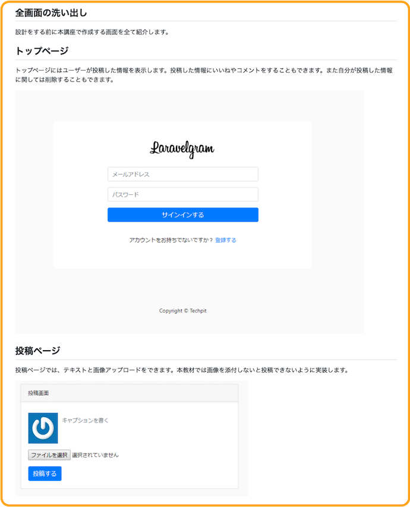
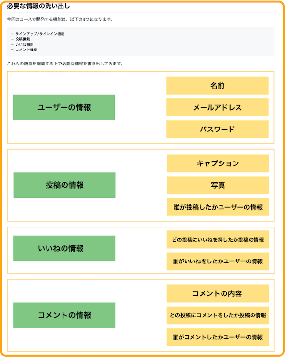
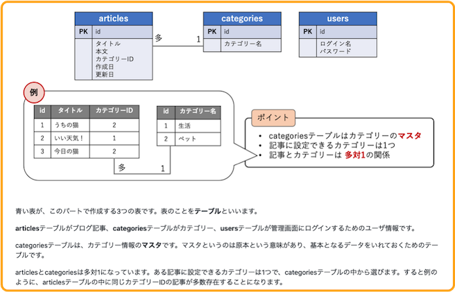
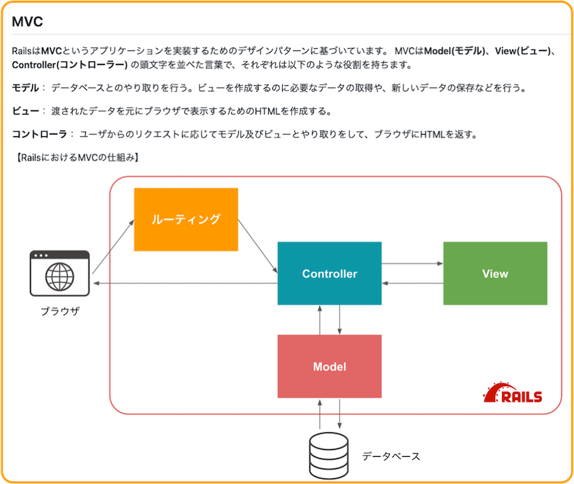

# 4-11 設計や概念を説明する際のフォーマット
サンプルアプリを作成する場合には、以下に従い、その設計についても説明するようにしてください。
1. 実装に必要なものを洗い出す
2. データベースを使用する場合はテーブルの設計を明記する
3. 概念を説明する場合は図を使って説明する

項目を一つずつ説明します。

## 1. 実装に必要なものを洗い出す
学習者がサンプルアプリを実装していくにあたっては、完成までのおおよその道筋を示すことが重要です。道筋を知っているかいないかでは、理解度やモチベーションに大きな差が生まれます。

適切にやるべきことを洗い出し、道筋を示すことで「何をやったらアプリが完成するか」を見通すことができるようになります。

主に記載すべきことは以下の3点です。

- **どのような画面があるか、その画面で何ができるのかの一覧**
- **画面を実現するために必要な処理とデータの一覧**
- **データベースを使用する場合のテーブル設計**（詳しくは後述します）

図やスクリーンショットを用いつつ、上記の点を説明することで学習者にも設計プロセスの追体験を与えることができます。

### 例 完成までについての説明記述

## 2. データベースを使用する場合はテーブルの設計を明記する。
データベースを用いる場合は、必ずどのようなテーブルを設計を**ER図などの図を用いて**説明をお願いいたします。

実装の中でもデータベースは特に複雑になりやすい部分です。視覚的にどのような情報があり、どのような関係性があるのかを共有することが学習者の実装への理解に大きく寄与します。

また、それぞれのテーブルにどのような情報が格納されているかを文章や表などで補足してください。

### 例 実装するデータベースのテーブル設計についての記述

## 3. 概念を説明する場合は図を使って説明する
MVCやVuex、オブジェクト指向、Dockerなど実装・利用にあたって予め知っておくべき知識や概念を教材で説明する場合は、**文章だけではなく図を使って** 説明を視覚的に補助するようにお願いいたします。

### 例 MVCについての説明

