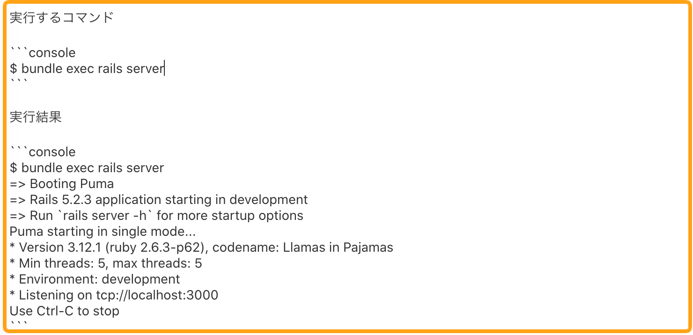

# 4-8 見やすい文章を書くためのマークダウンの書き方

分かりやすい教材を執筆するには、見やすい文章を書く必要があります。このガイドラインではどのようにマークダウンを使えば見やすい文書を書くことができるか紹介します。

ここには以下の内容があります。

* **見出しの使い方**
* **リンクの書き方**
* **文章中に出てくるファイルパスやコードはインラインで表示**
* **ディレクトリツリーの書き方**
* **コマンドの書き方**
* **コードの書き方**
* **箇条書きが続く場合は表を活用**
* **引用について**

\*\*\*\*

### 1. 見出しの使い方

見出しを適切に使うとそのページ内の文章の構成がはっきりとなり、学習者はページの内容をストレスなく理解できるようになります。そのため、見出しを使うときは以下を注意して使いましょう。

* 見出し１（h1）は１ページ１つにすること
* 見出しに使うのはh2とh3だけでh4以降は使わない

#### 見出し１（h1）は１ページ１つにすること

h1タグ\(\#\)は、そのページでもっとも重要なテキストに対して使用します。そのためh1タグは、パートのタイトルだけに使用しましょう。

#### 見出しに使うのはh2とh3だけでh4以降は使わない

h2\(\#\#\)やh3\(\#\#\#\)は教材に反映することができるのですが、現状\(h4\)は普通の文字列として認識されるので、見出しを使う場合は、h2やh3を使うようにしてください。


Techpit 独自のエディターで執筆している方は、パートタイトルは別のフォームに記載するので、見出しはh2とh3だけを使ってください。


### 

### 2. リンクの書き方

リンクを記載するときは、URLをベタ打ちではなく、マークダウンのテキストで記載していただければと思います。

**【例】**

### 3. 文章中に出てくるファイルパスやコードはインラインで表示

文章中にファイル名やコードを記載するはインラインで表示したほうが、文章が見やすいです。なので以下の画像の例のようにインラインで表示してください。

**【例】**

### 4. ディレクトリツリーの書き方

ディレクトリツリーを記載する際は、コードブロックで表示してください。特に拡張子をつけてシンタックスハイライト表示にする必要はありません。

※Windows 標準のtreeはご利用できませんのでご了承ください。

### 5. コマンドの書き方

コマンドを記載する際は、コードブロックでコマンドを記載してください。また拡張子にあたる部分に`console` と付けてシンタックスハイライトで表示してください。

**【例】**

### 6. コードの書き方

コードを記載する際は、コードブロックでコードを表示し、**必ずコードの拡張子を記載**してシンタックスハイライトで表示してください。コードの拡張子を記載しなければコードに色がつかず、コードが見づらくなるからです。

またコードの差分を表すには`diff`を使ってください。


Techpit 独自のエディターで執筆している方は、diffでコードに色をつけることができます。


### 7. 箇条書きが続く場合は表を活用

まず箇条書きを続けてテキストで表示した場合どのように表示されるか例を下記に示します。

**【例】**

次に上記の文書を表形式で表示した場合どのようになるか例を下記に示します。

**【例】**

このように表形式で表示した方が見やすいことがあるので、その際はマークダウンで表形式で表示するようにしてください。

### 8. 引用について

引用は、文頭に `>` を置くことで引用になります。引用を使う場合は**出典**を明記してください。出典の明記方法は以下に示します。

**【書籍の場合】**

書籍を引用する場合は、以下の内容を記載してください。

1. 著者名
2. 『書名』
3. 出版社
4. 出版年
5. 該当ページ

**例\)**

* Dustin Boswell; Trevor Foucher. リーダブルコード. 角 征典訳. オライリージャパン, 2012, 3p.

著者が複数名いる場合は、著者を並べて書く必要があります。和文著書の場合は`,` を、欧文著者の場合は `;` を使ってください。

**【Webサイトを引用する場合】**

Webサイトに掲載されている情報をそのまま引用する場合、以下の内容を記載してください。

1. 該当ページのタイトル
2. URL

**例\)**

* 著作権なるほど質問箱. [https://pf.bunka.go.jp/chosaku/chosakuken/naruhodo/answer.asp?Q\_ID=0000304&fbclid=IwAR1Z9jGTfYzJ7NDuAjGyr7VZVp1\_xhO8svvZRy2qHDfAsvODiGWvVy3c0e8](https://pf.bunka.go.jp/chosaku/chosakuken/naruhodo/answer.asp?Q_ID=0000304&fbclid=IwAR1Z9jGTfYzJ7NDuAjGyr7VZVp1_xhO8svvZRy2qHDfAsvODiGWvVy3c0e8)

#### 引用の要件の成立について

著作権上、引用は要件が成立していれば著作権者の了解なしに行えます。ここで言う要件とは以下のように定められています。

> 「引用」とは、例えば自説を補強するために自分の論文の中に他人の文章を掲載しそれを解説する場合のこと

* 著作権なるほど質問箱. [https://pf.bunka.go.jp/chosaku/chosakuken/naruhodo/answer.asp?Q\_ID=0000304&fbclid=IwAR1Z9jGTfYzJ7NDuAjGyr7VZVp1\_xhO8svvZRy2qHDfAsvODiGWvVy3c0e8](https://pf.bunka.go.jp/chosaku/chosakuken/naruhodo/answer.asp?Q_ID=0000304&fbclid=IwAR1Z9jGTfYzJ7NDuAjGyr7VZVp1_xhO8svvZRy2qHDfAsvODiGWvVy3c0e8)

なので、引用はあくまでご自身で執筆した説明を補強するために使ってください。

