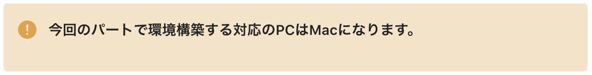

# 4-8 見やすい文章を書くためのマークダウンの書き方

分かりやすい教材を執筆するには、見やすい文章を書く必要があります。このガイドラインではどのようにマークダウンを使えば見やすい文書を書くことができるか紹介します。

ここには以下の内容があります。

* **見出しの使い方**
* **リンクの書き方**
* **文章中に出てくるファイルパスやコードはインラインで表示**
* **ディレクトリツリーの書き方**
* **コマンドの書き方**
* **コードの書き方**
* **箇条書きが続く場合は表を活用**
* **引用について**
* **改行について**
* **注意について**
* **補足・コラムについて**

## 1. 見出しの使い方

見出しを適切に使うとそのページ内の文章の構成がはっきりとなり、学習者はページの内容をストレスなく理解できるようになります。そのため、見出しを使うときは以下を注意して使いましょう。

* 見出し１（h1）は１ページ１つにすること
* 見出しに使うのはh2とh3だけでh4以降は使わない

### 見出し１（h1）は１ページ１つにすること

h1タグ\(\#\)は、そのページでもっとも重要なテキストに対して使用します。そのためh1タグは、節のタイトルだけに使用しましょう。

### 見出しに使うのはh2とh3だけでh4以降非推奨としています

\(h4\)は**通常の太文字**と同じフォントサイズになります。見出しとしての意味をあまりなさないので、見出しを使う場合は、h2やh3を使うようにしてください。


## 2. リンクの書き方

リンクを記載するときは、URLをベタ打ちではなく、マークダウンのテキストで記載していただければと思います。

**【例】**


## 3. 文章中に出てくるファイルパスやコードはインラインで表示

文章中にファイル名やコードを記載するはインラインで表示したほうが、文章が見やすいです。なので以下の画像の例のようにインラインで表示してください。

**【例】**


## 4. ディレクトリツリーの書き方

ディレクトリツリーを記載する際は、コードブロックで表示してください。特に拡張子をつけてシンタックスハイライト表示にする必要はありません。


※Windows 標準のtreeはご利用できませんのでご了承ください。

## 5. コマンドの書き方

コマンドを記載する際は、コードブロックでコマンドを記載してください。また拡張子にあたる部分に`console` と付けてシンタックスハイライトで表示してください。

**【例】**


## 6. コードの書き方

コードを記載する際は、以下の点を守るようにしてください。


1. \`\`\`と\`\`\`で囲むことでコードブロックで表示する
2. \`\`\`の後にコードのファイル拡張子を付けて、コードに色の付くシンタックスハイライトで表示する
3. ファイル拡張子の後に`:ファイルパス`を付けることで、操作対象のファイルが何であるのかよりわかりやすくする 


マークダウンで実際に記述した例は以下になります。


これはTechpit上では以下のように表示されます。


またコードの差分を表すには`diff`を使ってください。


## 7. 箇条書きが続く場合は表を活用

まず箇条書きを続けてテキストで表示した場合どのように表示されるか例を下記に示します。

**【例】**


次に上記の文書を表形式で表示した場合どのようになるか例を下記に示します。

**【例】**


このように表形式で表示した方が見やすいことがあるので、その際はマークダウンで表形式で表示するようにしてください。

## 8. 引用について

引用は、文頭に `>` を置くことで引用になります。引用を使う場合は**出典**を明記してください。出典の明記方法は以下に示します。

**【書籍の場合】**

書籍を引用する場合は、以下の内容を記載してください。

1. 著者名
2. 『書名』
3. 出版社
4. 出版年
5. 該当ページ

**例\)**

* Dustin Boswell; Trevor Foucher. リーダブルコード. 角 征典訳. オライリージャパン, 2012, 3p.

著者が複数名いる場合は、著者を並べて書く必要があります。和文著書の場合は`,` を、欧文著者の場合は `;` を使ってください。

**【Webサイトを引用する場合】**

Webサイトに掲載されている情報をそのまま引用する場合、以下の内容を記載してください。

1. 該当ページのタイトル
2. URL

**例\)**

* 著作権なるほど質問箱. [https://pf.bunka.go.jp/chosaku/chosakuken/naruhodo/answer.asp?Q\_ID=0000304&fbclid=IwAR1Z9jGTfYzJ7NDuAjGyr7VZVp1\_xhO8svvZRy2qHDfAsvODiGWvVy3c0e8](https://pf.bunka.go.jp/chosaku/chosakuken/naruhodo/answer.asp?Q_ID=0000304&fbclid=IwAR1Z9jGTfYzJ7NDuAjGyr7VZVp1_xhO8svvZRy2qHDfAsvODiGWvVy3c0e8)

### 引用の要件の成立について

著作権上、引用は要件が成立していれば著作権者の了解なしに行えます。ここで言う要件とは以下のように定められています。

> 「引用」とは、例えば自説を補強するために自分の論文の中に他人の文章を掲載しそれを解説する場合のこと

* 著作権なるほど質問箱. [https://pf.bunka.go.jp/chosaku/chosakuken/naruhodo/answer.asp?Q\_ID=0000304&fbclid=IwAR1Z9jGTfYzJ7NDuAjGyr7VZVp1\_xhO8svvZRy2qHDfAsvODiGWvVy3c0e8](https://pf.bunka.go.jp/chosaku/chosakuken/naruhodo/answer.asp?Q_ID=0000304&fbclid=IwAR1Z9jGTfYzJ7NDuAjGyr7VZVp1_xhO8svvZRy2qHDfAsvODiGWvVy3c0e8)

なので、引用はあくまでご自身で執筆した説明を補強するために使ってください。

## 9. 改行について

執筆を進めていって、文章を改行したいというときは多くあると思います。改行の書き方に関しては、基本的に「1行空白の行を入れる」形で改行してください。

`<br>` や`スペース2つ`でも改行はできますが、Techpitでは「1行空白の行を入れる」を使った改行で統一できればと思います。

## 10. 注意について

教材内で受講生に注意喚起をしたい際に使用するマークダウンの独自記法をご用意しました。

```
::: warn
注意 をこちらに書きます
:::
```

**※ 執筆はGithubで行いますので、Github上では以下のように表示されないこと予めご理解ください。**


### 使用ケース

**ケース１）教材代とは別途サービスの利用料が発生する場合やセキュリティ面で注意する必要があることを喚起したい場合**


**ケース２）教材の対応OSや対応バージョンを強調したい場合**



## 11. 補足・コラムについて

教材内で補足説明やコラムを追加したい際に使用するマークダウンの独自記法をご用意しました。

```
::: info
補足・コラム をこちらに書きます
::::
```


### 補足

補足は直訳すると、**不十分なところを付け足して補うこと**です。

つまり、すでに執筆した内容で説明が足りていない部分に後から説明を追加したい際に使用するのが正しい使用法となります。

想定される補足の使用タイミングとしては、受講生からの質問で説明をもう少し付け加えた方がいいなと思ったときや、複数の実装パターンがあって受講生が疑問を持ちそうな部分を先回りして解決したいときなどが考えられます。

補足の参考）


**※ 「注意」と「補足・コラム」の独自記法内では、テキストだけでなくコードブロックや画像の使用も可能です。**

### コラム

コラムは、**個人的な見解を含んだ文章**となります。

教材内において、事実と主張が入り混ざっている状態だと文章がとても読みづらくなってしまいます。

それを避けるためにも、なるべく個人やその個人を取り巻く環境に依存するような内容はコラムとして切り出してご紹介するのがオススメです。

コラムの参考）


