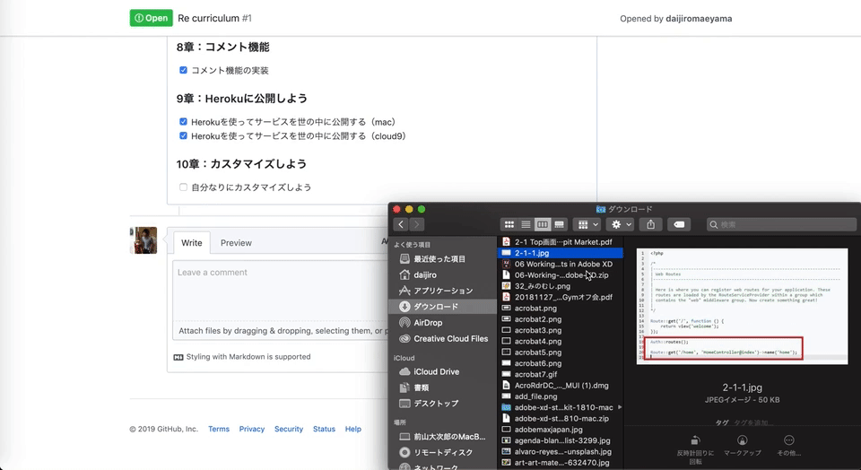

# 画像の追加方法

画像の追加方法を紹介します。

### **1 Gyazoを使用したやり方**

無料で使える[Gyazo](https://gyazo.com/ja)というツールを使えば簡単にマークダウン形式で画像を挿入できます。

Gyazoをインストールすると拡張機能として使用できます。起動後にカーソルで保存したい範囲を指定します。指を話すと指定した範囲が記録されブラウザへ移動します。  
上部にある「シェア」という部分をクリックするとマークダウンの項目があるのでリンクを取得します。取得したリンクをgithubの教材に貼り付ければ画像として認識されます。  
ここまで説明した機能は無料でお使いいただけますのでぜひ使ってみてください。

### **2 Githubを使用したやり方**

スクリーンショットなどの画像データ（pngファイルやjpgファイルなど）をGithubに簡単に追加するには、Github上のissueやPull requestsのコメントのフォームに画像をドロック&ドロップで追加すると、画像のURLを取得できます。

URLを取得できたら、カリキュラムにマークダウンで画像を反映することができます。

もちろん今回紹介したやり方以外でもマークダウンで画像を反映することができればどのやり方でも構いません。

