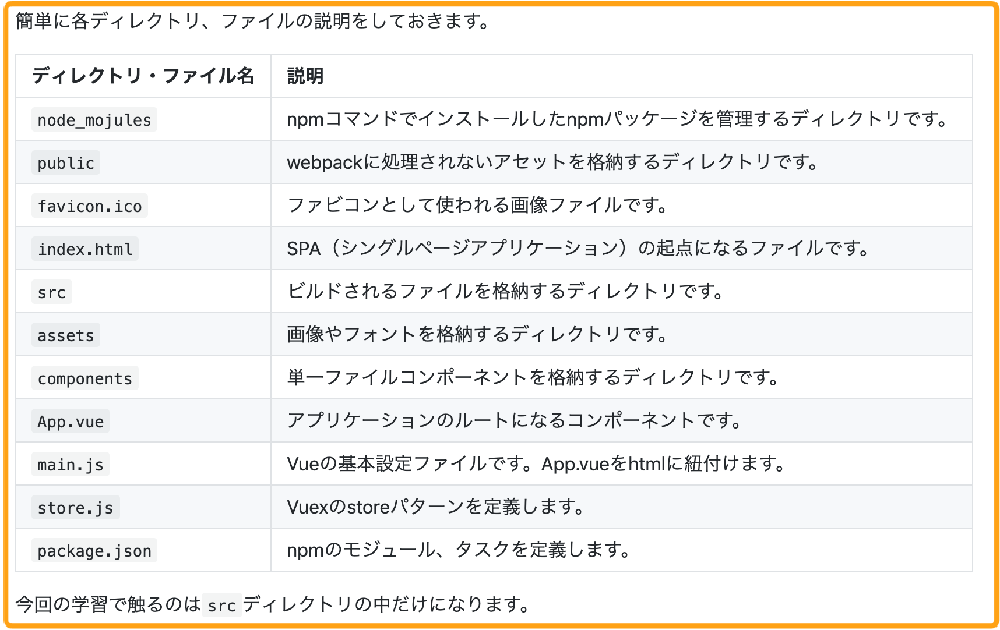

# 4-6 見やすい文章を書くためのマークダウンの書き方

分かりやすい教材を執筆するには、見やすい文章を書く必要があります。このガイドラインではどのようにマークダウンを使えば見やすい文書を書くことができるか紹介します。

ここには以下の内容があります。

* **見出しの使い方**
* **リンクの書き方**
* **文章中に出てくるファイルパスやコードはインラインで表示**
* **ディレクトリツリーの書き方**
* **箇条書きが続く場合は表を活用**

### 1. 見出しの使い方

見出しを適切に使うとそのページ内の文章の構成がはっきりとなり、学習者はページの内容をストレスなく理解できるようになります。そのため、見出しを使うときは以下を注意して使いましょう。

* 見出し１（h1）は１ページ１つにすること
* 見出しに使うのはh2とh3だけでh4以降は使わない

#### 見出し１（h1）は１ページ１つにすること

h1タグ\(\#\)は、そのページでもっとも重要なテキストに対して使用します。そのためh1タグは、パートのタイトルだけに使用しましょう。

#### 見出しに使うのはh2とh3だけでh4以降は使わない

h2\(\#\#\)やh3\(\#\#\#\)は教材に反映することができるのですが、現状\(h4\)は普通の文字列として認識されるので、見出しを使う場合は、h2やh3を使うようにしてください。

### 2. リンクの書き方

リンクを記載するときは、URLをベタ打ちではなく、マークダウンのテキストで記載していただければと思います。

**【例】**

\*\*\*\*

### 3. 文章中に出てくるファイルパスやコードはインラインで表示

文章中にファイル名やコードを記載するはインラインで表示したほうが、文章が見やすいです。なので以下の画像の例のようにインラインで表示してください。

**【例】**

### 4. ディレクトリツリーの書き方

### **5**. 箇条書きが続く場合は表を活用

まず箇条書きを続けてテキストで表示した場合どのように表示されるか例を下記に示します。

**【例】**

次に上記の文書を表形式で表示した場合どのようになるか例を下記に示します。

**【例】**

このように表形式で表示した方が見やすいことがあるので、その際はマークダウンで表形式で表示するようにしてください。

